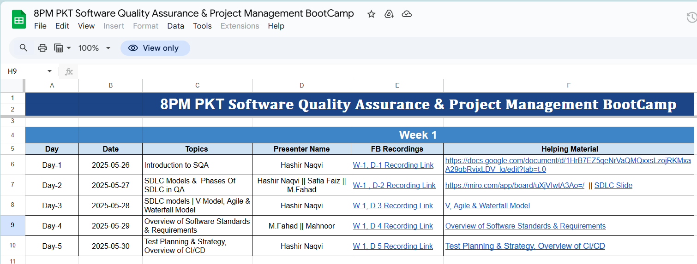
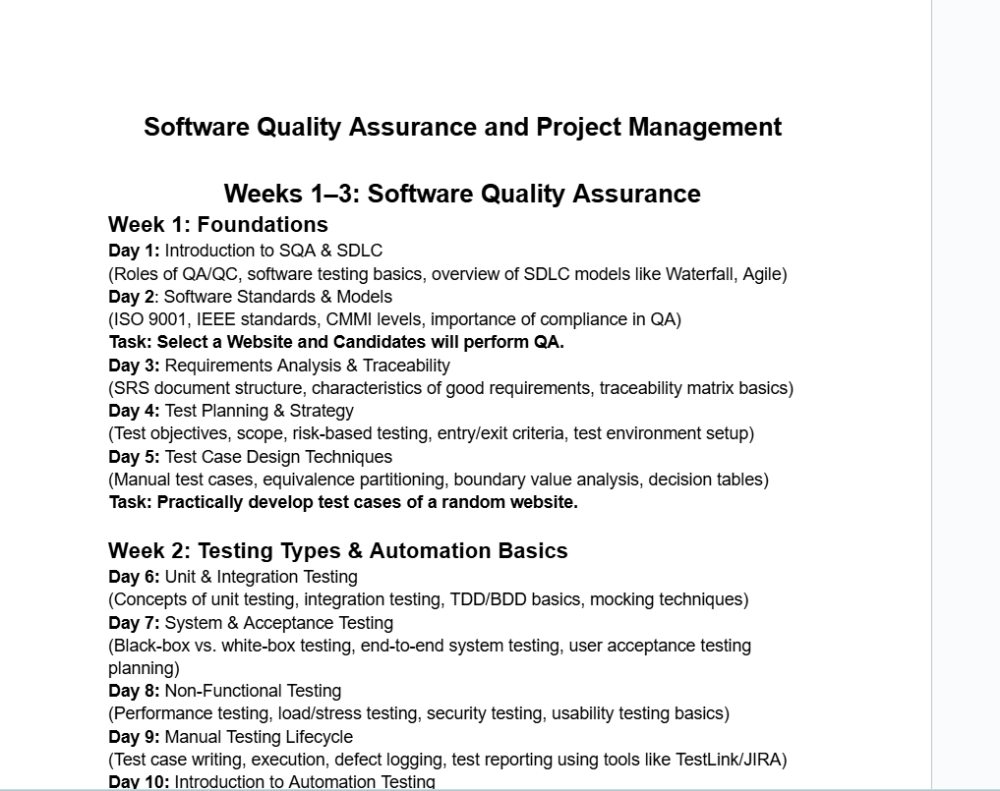

# Software Quality Assurance & Project Management Bootcamp

> **Organized by:** [iCodeGuru](https://icodeguru.com)  
> **Trainer & Moderator:** 
> Muhammad Fahad Bashir |  Hashir Naqvi | Mam Mahnoor | Safia Faiz
> 📍 Location: Online Zoom
> 🗓 Duration: 4 Weeks
> 🧑‍💻 Format: Live 8pm-9pm (Monday -Friday) 
>  Date : 26 May - 27 June 2025
> 

- [Software Quality Assurance \& Project Management Bootcamp](#software-quality-assurance--project-management-bootcamp)
  - [📚 Course Overview](#-course-overview)
  - [Course Sheet](#course-sheet)
  - [Course outline](#course-outline)
  - [Important Slides](#important-slides)
  - [Other Resources](#other-resources)
  - [🙋‍♂️ Find Me](#️-find-me)

---

## 📚 Course Overview

This repository contains the course outline , resources & activities, used in the 4-week bootcamp covering:

- ✅ Software Quality Assurance (SQA)
- ✅ Project Management (PM) Fundamentals
- ✅ Manual & Automated Testing (Selenium, JIRA, GitHub)
- ✅ Real-world project simulation 

The course was designed to bridge academic understanding with industry practices through step-by-step project simulation, testing strategies, Agile practices, and QA planning.

## Course Sheet 

You can access the complete Course Tracker Sheet using the link below. It contains:
* 📅 Day & Date
* 📝 Topic Covered
* 🎤 Presenter Name
* 🎥 Recording Links
* 📂 Resource Materials (slides, files, links)

👉 [Click here to open the Course Sheet](https://docs.google.com/spreadsheets/d/1t5sld3cnvPUBL__O4ee4ijUojrcRJIS0TN_3wNfzgh4/edit?gid=0#gid=0)

## Course outline 
Below is the course outline 
[Click Here ](https://docs.google.com/document/d/1HrB7EZ5qeNrVaQMQxxsLzojRKMxaA29gbRyjxLDV_lg/edit?tab=t.0)

## Important Slides 
Below are some of the slide that i present during the class
check out the folder **Important Lecture Notes**

## Other Resources

While the main learning materials are covered in the course outline and slides, you’ll also find additional helpful resources in this repository, including:

- 🧪 **Sample Projects** — End-to-end Food Delivery App for QA & PM simulation  
- 📝 **Excel Templates** — Test cases, traceability matrix, test plan, risk register, etc.  
- 🧰 **Automation Scripts** — Selenium test scripts for login, cart, and order workflows  
- 🔧 **JIRA Screenshots** — Examples of sprint boards, dashboards, bug reports  
- 🌐 **Useful Links** — Docs, tools, and references used throughout the course

Make sure to explore the subfolders like `Week 4.5`, `Last Day`, and `Important Lecture Notes` for final content summaries, recap presentations, and practical files.

-----
## 🙋‍♂️ Find Me

If you found this course useful or want to collaborate on QA, testing, or project management initiatives, feel free to connect with me:

- 💼 [LinkedIn – Muhammad Fahad Bashir ](https://www.linkedin.com/in/mfahadbashir/)
- 💻 [GitHub – muhammadfahd](https://github.com/muhammadfahd)
- 📧 [Email](bashirfahad789@gmail.com)

I’m always open to learning, mentoring, and contributing to impactful tech projects. 🚀

